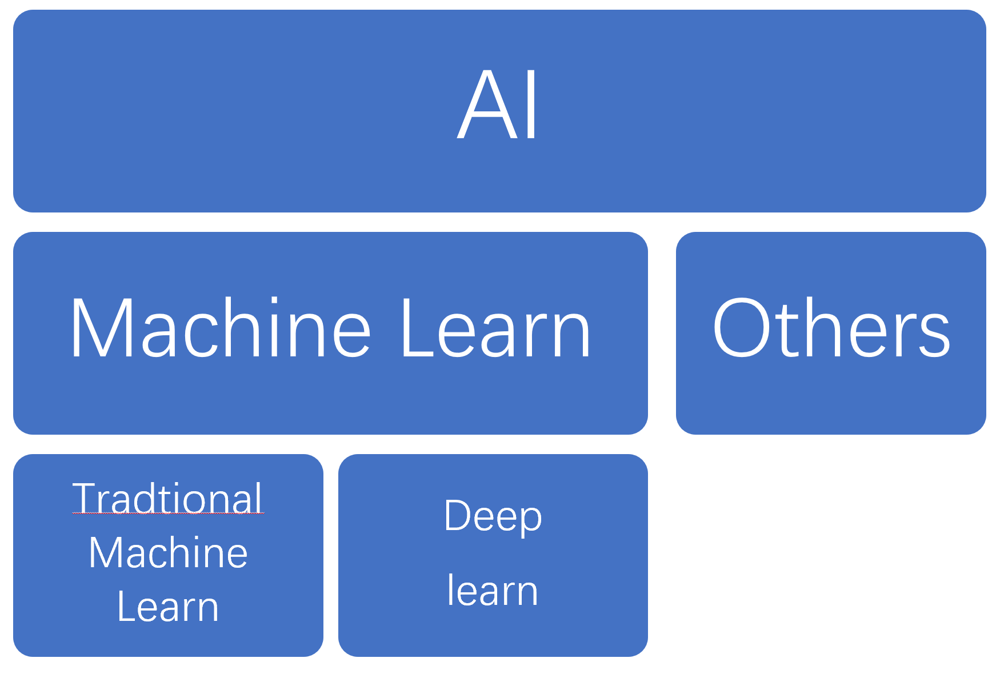

读取数据如`.nii`、`.csv`或者`.mat`以及`.txt`文件，把数据加载

机器学习的概念分类、常见评估方法、评价指标

今天使用的包就是`nibabel`和`scipy`哦还有`numpy`

# 导入包和数据

## 导入包（库）

在上次我废了九牛二虎之力改了pip.ini的配置，最后还是求教了计科的万祚全兄才理解了anaconda的使用和一些朴素概念，这个过程如果没有祚全兄的援助对一个需求仅仅是数据处理的非cs出身用户而言十分恶心。

和r一样，我们需要在程序开始之前设置好需要加载的包（不过为啥不先说设置改变当前工作路径）。

```
#这是加载整个库
import nibabel
import scipy
```

```
#有时候这个库的名字怪长，我们给它起个简单外号
import numpy as np  #给numpy起个外号叫ny
```

```
#有些库其实本身比较大，我们也不用每次都加载全部库，我们可以仅导入（访问）下层属性
#下面这个例子就是仅仅加载numpy中的numpy.random这个属性
from numpy import random


#或者可以这样输入
import matplotlib.pyplot
```

<p>

## 导入数据

一般来说需要把数据进行预处理后，保存为`*_.mat`后我们再在机器学习里读取，我们很少直接读取`*_.nii`和`*_>img`。

### `.nii`格式

首先需要把路径整进去，这里的引号也可以是单引号：

```
data_path = r"文件路径"   #代码中路径之前的r是指通过只读模式打开数据，一般都是加r
data_path = "E:\\SZU\\fmri机器学习\\parc_data\\data_load_data\\*_.csv"   #或者跟r一样都打俩斜杠来实现只读


#以上代码只是将这个路径赋值一个叫data_path的变量，这个变量之后会用到
```

<p>

然后再使用nibabel库其中的下层函数来访问刚刚被赋值的data_path变量（好奇跳过变量访问路径行不行）。

```
import nibabel.load   #导入需要的库或者这个库下层我们所需要的属性
fMRI_data = nibabel.load(data_path)   #通过“.”来实现访问下层函数或属性
```

<p>

通过以上操作，我们得到的fMRI_data变量虽然以nifti数据格式导入，但是我们机器学习得把这个转化为矩阵才能接着干活，所以使用以下函数将其转化为python中常用的numpy格式。

```
fMRI_data = fMRI_data.get_fdata()   #通过下层的get函数获取文件的float data，能够得到可用于运算的浮点数矩阵
print(fMRI_data.shape)   #通过print访问变量fMRI_data的下层属性shape，使得我们能够得知这个数据的尺寸
```

<p>

假如我们需要单独去查阅其中某一张，比如第三张frame，我们可以使用下面的函数实现：

```
fMRI_3TR = fMRI_data[:,:,:,2]   #python使用方括号检索数据、用冒号代表全部。
#同时哈，注意在python中因为数数是从0开始数的，所以实际我们的0为first、1是second，而这里的2其实就是third，第三个frame


fMRI_data3TR_x = fMRI_data[34,:,:,2]   #这里其实就是我们要检索第1张frame（别忘了python从0开始数数）中坐标为（34，43，56）的体素


#针对那个切面我们可以用下面的函数来画图：
plt.imshow(fMRI_3TR_x, 'gray')   #使用灰度模式画图


#绘图仅需要了解，一般不拿python绘图
```

<p>

以上我们需要理解的重点在于**索引**和python**从0开始数数**这个原则（以及在实务中我们要从这个原则出发做出适应行为）。当然之前的数据读取也是很重要的。

### `.img`和`.hdr`格式

这个其实和加载`.nii`数据时用的代码一样，不过这里需要补充一个如果我们的数据只包含了1个frame，我们可以试着“切除阑尾”，把第4个维度的值给去掉直接（如果有的话）。

拿我们刚刚的那个fMRI数据为例：

```
fMRI_data = np.reshape(fMRI_data, [64,64,64])
#不过需要注意的就是，这里np.reshape里面中括号的内容必须得是“把水倒满”，那仨维度有几个值就填几，而且还不能用冒号来省略
```

<p>

### `.mat`数据

据培训，这个类型的数据为python中机器学习主要使用的数据。深度学习可能会用到那几个数据类型。加载这种类型的数据是这节课的重点。这里我在听课的时候猜测如果和之前核磁培训练习起来的话，应该是一阶二阶检验contrast的产物。

```
mat_file_path = r'E:\SZU\fmri机器学习\parc_data\data_load_data\mat\mat_test.mat'


import scipy.io   #导入需要的库或者这个库下层我们所需要的属性


mat_file = scipy.io.loadmat('mat_file_path')   #使用我们导入的包加载数据
#完成以上后，我们的mat数据会被以dict（字典）类型导入进来，但是同样的，这没法我们在机器学习里用来分析特征值，所以还得转格式：


mat_data = mat_file['data']   #这样把我们可以用来分析的部分提取出来，data就是mat里面的矩阵，其实这个名字可以改，所以实际使用的时候还是得看看文件里的矩阵具体的名字是啥
```

<p>

刚刚的课程中我们学了怎么读取`.mat`文件，这里我们学习怎么在程序中保存mat文件：

```
#首先和读取一样，我们设置以下保存路径和保存的文件名，这里命名文件的时候别忘加后缀
saved_data_path = r'E:\SZU\fmri机器学习\parc_data\data_load_data\mat\test.mat'


#类似于读取的时候，我们按照刚刚定义的命名和路径下达保存的命令
scipy.io.savemat(saved_data_path, {"x": mat_data})
#这个函数第1个参数是我们刚刚定义的保存路径和命名；第二个参数是mat文件中我们命名不同的部分以及该部分的填充内容或数据。


#其实我们也可以说这样保存啊
scipy.io.savemat(saved_data_path,
                {"部分一": mat_data},
                {"那这一部分我也可以随便写个向量}: [1,1,4,5,1,1],
                {"那这一部分我可以当阑尾"}: 6)
```

<p>

### `.txt`文件

这里需要借助numpy.np的力量

```
#首先导入np包
import numpy as np


#然后定义要加载的文件和路径
txt_path = r'E:\SZU\fmri机器学习\parc_data\data_load_data\txt\txt_test1.txt'


#之后我们使用刚刚导入的包加载数据
txt_data = np.loadtxt(txt_path,
                      deliniter = ' ')   #这个参数是用于定义你的分隔符，默认是空格，如果你的数据是用逗号或者|分隔的数据你不定义这个参数程序报错
```

<p>

### `.csv`数据

行为数据可以放在这里，可是为什么不用`.xls`或者`.xlsx`啊

```
#同样，这里需要导入我们需要的包
import panda as pd
import numpy as np


#然后接着还是定义路径和载入的文件
csv_path = r'E:\SZU\fmri机器学习\parc_data\data_load_data\csv\csv_test.csv'


#还是用包内函数按照刚刚定义的路径加载数据
csv_file = pd.read_csv(csv_path)


#仍然这种文件我们需要进行矩阵化转换，矩阵中有中文培训里说no problem
csv_array = np.array(csv_file)
```

<p>

### `.npy`格式

这是python的数据格式，类似与`.mat`之于matlab，后面培训没讲，我一个外行只能以后填坑。

------------------------------------------------------------------------

# 理论知识讲解

## 概念澄清

首先培训里画了维恩图，ai包括机器学习（ML）、机器学习包括传统机器学习（TML）和深度学习（DL）。深度学习涉及深层次（很多中间层级）的神经网络；传统机器学习主要靠明确的数学算法来实现模式识别？（这一块是我在听课时候猜的）。而本次培训主要讲解的便是基础的传统机器学习

{width="500"}

<p>

## 机器学习的基础概念

机器学习一般可以分为**训练**和**测试**两个步骤。

- 训练：让模型学习数据的特征特点
    - 训练集：供模型学习使用的一批数据
- 测试：让模型对**新的数据**进行预测，对比预测结果和实际结果之间的差异（预测的成功与否）
    - 测试集：供模型测试使用的一批数据

<font color=red> 训练集和测试集的内容发生重叠是一个严重错误！</font>所以一般情况训练集和测试集的内容应该完全不相同。但是培训中提了在深度学习中要是混了也不是不行。

## 机器学习的分类

本培训的重点在于有监督学习、无监督学习也会提一些。

### 按照学习方式分类

- 有监督学习：训练数据包含数据本身（习题）及其对应的标签（参考答案），每个训练数据都有一个明确的标示或结果（个人觉得说白了就像我每次练习后对答案从而学习正确答案）
- 无监督学习：训练数据只包含数据本身（习题）而不含其对应的标签（参考答案）。模型能够自主地学习到一些数据的特点（对于备考的学生来说这就很地狱了，被强迫刷题但是不给你参考答案。。。）
    - 适用无监督学习的情况：缺乏先验知识，因此难以对数据进行标注或者标注成本太高时（没有参考答案还考啥行测）。培训里有提：EEG用的多；fMRI少点
- 半监督学习：部分数据有标签、部分数据没有标签。本培训建议这个知道定义就可以，这个主要是工科做
- 强化学习：该类型中，标签可以不是一个明确的标示或结果，而是一个反馈或奖励（赛博斯金纳）。

区分有无监督的标志在于是否存在标签。

### 按照算法原理分类

这个就是分TML和DL，其中TML（不包含任何人工神经网络ANN结构，是本次培训的重点）。

## 有监督学习

### 有监督学习在干嘛

有监督学习一般解决两个问题：**分类**和**回归**。如果提到这俩玩意，你的前提就是在做有监督学习。两者的本质就是对输入进行预测。

||分类|回归|
|---|---|---|
|输出|一个分类的类别（物体所属的类别）|一个具体的值（物体的值）|
|输入类型|离散值|连续值|
|举例：假如输入视交叉上核的各个属性|输出：gay或者非gay|输出：可能与之关联的--垂体的体积|

<p>

### 有监督学习都有啥（仅作了解）

其实很多方法既可以用于做分类、也可以用于做回归，只是我们需要对输入做一些改进。培训之后的课程会讲到。

|分类|回归|
|---|---|
|逻辑回归|线性回归|
|分类树|逻辑树|
|支持向量网络|贝叶斯网络|
|人工神经网络|模糊分类|
|随机森林|人工神经网络|

## 无监督学习

### 无监督学习在干嘛

无监督学习一般解决两个问题：**聚类**和**降维**。其中，聚类是在数据不带有标签的情况下，模型按照数据自己的特征和分布将数据分成n个小类（分开点集，或称“簇”）的一种算法。常用的聚类算法有**K均值聚类**和**层次聚类**。

而聚类和分类不同的是，分类中数据带有标签，每个物体都有明确且具体的类别或归属。后聚类则没有数据标签、根据不同的算法我们可能会得到不同的结果。

降维则是采用某种映射方法，将高位空间的数据点映射到低维度的空间中（把10个特征变成3个特征：10维降到3维），降维是对数据本身处理，不需要标签。常用的降维算法有**PCA**、**张量分解**

## 有监督学习常见的评估方法

流出法、校验验证法以及自助法。

### 数据集划分

刚刚说得训练集和测试集划分比较老套，现在时兴的是**训练集**、**验证集**和**测试集**。这里面的关系可以分别对应到：课本、作业习题以及高考试卷上。其实就是我们把模型训练一次、验证一次，如此n次后我们将验证效果最好的模型送至测试。当然你也可以理解为验证集是一种特殊的训练集。

这里同样有一个重要原则**训练集和测试集一定不能混淆**。所以按照如今的时兴做法，就是我们要在训练集上训练模型，在验证集上评估模型并基于评估对模型调参。最后我们在测试集上测试模型。如果按照老书格子不分出新的验证集，那我们就是一次次那测试集评估调参，这就相当于我的的测试集参与了模型训练，打个比方，如果应届高考原题用于一次次应届考生平时练习，这肯定不合道理。

### 留出法

是最简单的模型评估法。基本思路就是将数据集D拆成俩互斥子集：训练集S（这里面又包含训练集S1和验证集V）和测试集T。然后就是像我们刚刚念叨的，训练集S1上训练模型>>>验证集V上评估模型并调参>>>测试集T上测试模型。一般我们选择20%左右的数据用作测试集。

但是这种方法因为是随机选择的数据，结果的方差可能会比较大。

### **校验验证法**

这个方法是本次培训的重点了。这个是针对留出法的缺陷做改进，能够充分利用数据集，但是数据集不可以太大，由于其所用的K折交叉技术运算大数据集的时间很长。下面是该方法的几个类型。其中留出测试集的K折交叉验证为常用方法，也是Sklearn的默认方法

|简单交叉验证|K折交叉验证（留出测试集|K折交叉验证（不留出测试集|留一交叉验证|
|---|---|---|---|
|这个和留出法比较类似，但不同的是该方法会反复随机打乱数据集到训练集和测试集然后不断训练、用**分类率**评估模型，最后选择最大或平均分类率作为最终分类率|把数据集分为互斥的训练集测试集（测试集晾一边恒定），而后将训练集分为K个大小相似的互斥子集，其中K-1个子集作为训练集、1个为验证集如此我们进行K次训练和评估并得到K个模型，在测试集上分别对K个模型得到分类率，K次测试分类率的均值为最终分类率|不再单独分出恒定的测试集，直接将数据集分为K个大小相近且互斥的子集，其中挑X个当训练集、Y个当验证集、Z个当测试集（X+Y+Z=K），一般X:Y:Z=7:2:1或者8:1:1。如果这样算，同样规模的数据集，不留出测试集能够进行更多的交叉验证（这样XYZ划分还多了个排列组合？），评估效果可能更好。|是K与样本个数N相等时的特殊K折交叉。每次只**留下一个样本**作为测试集，其余的样本作为训练集。如果数据集有N个样本，那么就会进行N次训练和评估，每次都会产生一个模型。在神经科学领域一用**留一被试法**，汇报评估指标的均值。|

<p>

培训说一篇文章建议K取5或10结果比较准确。不过这里我们需要补充机器学习语境下的被试独立和被试依赖。在心理学课程中，我们粗略理解被试间设计-被试独立；被试内设计-被试依赖，但是在机器学习语境下，这就会有点不一样了。我们知道核磁机器学习的语境下，一个被试可以是多个特征样本的集合，可以包含多个样本。如果一个被试的样本既出现在测试集又出现在训练集，这就是**被试依赖**；而如果一个被试的样本只参与了训练集或测试集，这就是**被试独立**。<font color=red>如果使用留一被试法，我们需要测试集是一个被试的所有样本作为一折（所以才叫“留”一个被试的方法啊）</font>,不过训练集和验证集可以随机分。

培训说实际代码环节我们用的是双重K折交叉验证。额，描述起来真绕。首先我们有一推数据集，第一步我们需要划分训练集和测试集，这一步中我们先进行一次K折（但是不验证）。第二步我们需要在上一步的每一次K折里再把训练集划分为训练集和验证集进行个K折交叉验证。感觉好像嵌套的循环语句（大循环套小循环），不过其实我也有点拿不准这个玩意和刚刚讲的不留测试集的K折交叉实质上有啥区别。

除了以上验证方法，培训里还讲到了Subject-wise和record-wise两种划分。前者是同一个被试的样本在划分时不会被严格打乱；后者是所有样本会被随机打乱。在神经科学中，record-wise不符合我们对模型学习效果的期望，存在验证集和训练集之间的被试依赖，模型更容易学习到样本和被试的相关性而非基于样本特征进行判断。因而我们可以采用subject-wise的划分，将训练集、验证集和测试集上的被试严格分开以保证模型学习的是样本的特征而非样本与被试的相关性。不过培训中也说明在实际中是否区分测试集的被试影响不大，主要需要区分验证集和训练集的被试（这俩数据集影响的才是模型的学习过程）。

## 有监督学习的评价指标

### 准确率

最简单的指标，但是并不能说明什么东西。这似乎涉及假设检验的弊端。

### 混淆矩阵

||预测值=1|预测值=0|
|---|---|---|
|**真实值=1**|TP 真阳性|FN 假阴性|
|**真实值=0**|FP 假阳性|TN 真阴性|

<p>

```
例题
假如我们一个模型对15个样本进行预测，结果如下：

真实值：0 1 1 0 1 1 0 0 1 0 1 0 1 0 0
预测值：1 1 1 1 1 0 0 0 0 0 1 1 1 0 1
```
可绘制出混淆矩阵：

||预测值=1|预测值=0|
|---|---|---|
|**真实值=1**|TP=5|FN=2|
|**真实值=0**|FP=4|TN=4|

<p>

我们虽然绘制了混淆矩阵，但是它咋用呢？其实就是以这个玩意作为原料计算一些指标：

- 精度（precision）或者PPV=`TP/(TP+FP)`
- 召回（recall）或者敏感度（sensitivity）再或者真阳性率（TPR）=`TP/(TP+FN)` 用于评估**漏诊率**
- 特异度（specificity）或者真阴性率（TNR）=`TN/(TN+Fp)` 用于评估**误诊率**
- F1值（F1-score）=`2TP/(2TP+FP+FN)`

我们还可以通过这个矩阵算数**ROC曲线**，x轴为真阳率`TPR=TP/(TP+FN)`、y轴为假阳率`FPR=FP/(FP+TN)`。这条曲线越靠近左上角越好（代表你的模型区分正负样本能力越好，表达模型综合能力）。另外这条曲线与x轴所围成的图形面积我们称为`AUC`，该值越高越代表完美，0.7以上表明模型就不错。

|AUC区间|意义|
|---|---|
|1|是完美的分类器|
|(0.85，0.95]|效果很好|
|(0.7，0.85]|效果一般|
|(0.5，0.7]|效果较低，但是用于预测股票已经很不错了|
|0.5|没有预测价值，随机猜测|
|[0，0.5)|比随机预测效果还差，但是可以用于反预测|

<p>

根据混淆矩阵我们还可以绘制**PR曲线**，x轴为敏感度、y轴为精度。曲线越靠近右上角越好。但是根据培训视频，该曲线图像仅供了解即可。